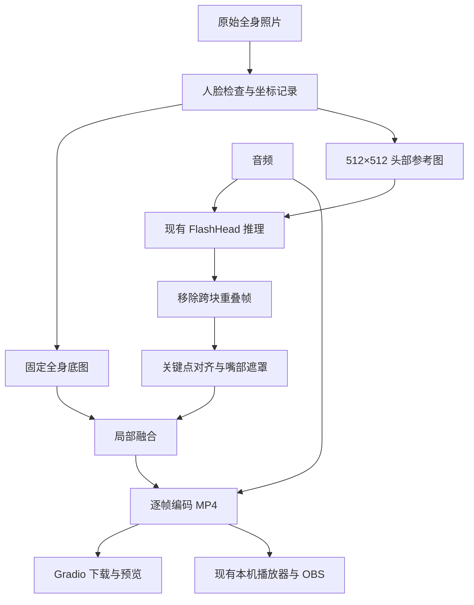

# 第一版全身说话：项目设计方案

日期：2026-10-09
状态：设计已由用户批准并实现；实际测试及后续细节见同目录上级测试记录。
项目：SoulX-FlashHead，Windows、单张 RTX 4090 D，现有 Gradio 与 OBS 本机预览。

最新修正：用户要求脖子随头部一起移动，因此动画范围进一步扩大到头颈与衣领，参考裁图改为人脸宽度的 2.6 倍并下移中心；在颈根附近向静止躯干渐变过渡。先前“衣领保护/脖子静止”相关描述为历史版本，当前验证见测试记录。

2026-10-10 比例修正：用户指出头部偏大。参考与生成帧抽查发现脸部跨度会改变。在合成前按原图太阳穴及眼角跨度的比例中位数限制额外放大，不使用会随口型变化的下巴跨度；整块头颈以原图颈根为中心均匀缩放，指数平滑控制尺寸变化，不做旋转/平移对齐，也不放大转头后变窄的脸部。缩放与画布映射合并，只重采样一次；有效图像覆盖范围一起羽化，无覆盖处保留原图，下方躯干保持固定。中央颈部遮罩收窄，避免肩带混入。此尺寸约束不等于改变真实焦距或拍摄透视。

后续调整：用户已批准完整复用生成头部的转头、眨眼、表情与口型，身体先保持静止。全身入口改用不取消头部运动的 `HeadCompositor`，采用固定头部区域与动态脸部轮廓融合保护衣领。以下嘴部限定与人脸重新对齐描述保留为第一版设计历史，当前行为及验证见 `docs/superpowers/full-body-test-report.md`。

## 1. 已确定的目标与边界

用户已选择第一版目标：整个人完整显示，嘴巴随音频说话，身体、衣服、头发和背景保持静止。输入为一张单人正面全身照与一段音频。输出为可下载、可在 OBS 预览的带声音 MP4。

第一版只做全身说话视频生成，不扩展产品资料库、自动讲解、弹幕回复或视频号账号登录。现有直播播放与 AI 标注继续使用。身体动作、转身、三视图融合、3D 建模和人物换装不纳入本轮。

默认输出设计为 1080×1920、25 fps。整张参考图片以等比例缩放加补边的方式置入画布；完整保留上传图片的范围，不补造源图中已经缺失的头或脚。补边使用原图四角 RGB 中位颜色，避免强行拉伸人物。第一版暂不提供一组分辨率和背景选项。

当前约 237×744 的测试全身图中，脸部宽度只有约 71 像素。之前的检测已找到一张脸，但这并不证明脸部关键点对齐和融合一定成功。放大与 1080p 编码不会恢复源图缺失的细节；必须用实际短视频验收。

## 2. 现有代码的实际情况

| 文件与入口 | 当前职责 | 与此次改造的关系 |
|---|---|---|
| `gradio_app.py::run_inference` | 加载模型、音频切片、逐块生成、缓存帧、导出 | 第一版入口，需要接入全身合成流程 |
| `gradio_app.py::dispatch_inference` | 单 GPU / 多 GPU 分流 | 保留已有调用接口，全身模式另加入口 |
| `flash_head/inference.py::get_base_data` | 将参考图片与配置传给 pipeline | 新流程仍复用它，不增加第二次裁剪 |
| `flash_head/inference.py::run_pipeline` | 返回头部图像帧 | 继续生成 512×512 头部帧 |
| `flash_head/utils/facecrop.py::process_image` | 检测人脸、扩大范围并返回裁剪图 | 只返回图片，没有原图坐标和补边映射信息 |
| `flash_head/utils/cpu_face_handler.py` | MediaPipe 人脸框检测 | 可复用，但新流程须明确拒绝零脸或多脸 |
| `flash_head/src/pipeline/flash_head_pipeline.py::get_cond_image_dict` | 加载条件图；裁脸失败后可退回原图 | 全身流程在进入这里前完成严格检查，不依赖静默回退 |
| `flash_head/utils/utils.py::resize_and_centercrop` | 等比例放大并裁取中央 | 保留现有模型处理；不把全身图直接送给它 |
| `gradio_app_streaming.py::run_inference_streaming` | 推理线程、队列、片段导出 | 后续流式阶段复用合成模块；第一阶段不启用全身流式功能 |
| `live_setup.py` 与 `live_ui/player.html` | 已生成 MP4 的选择和播放、固定 AI 标注 | 第一版结果沿用 `res_*.mp4` 即可被现有页面发现 |

现有推理尺寸在 `flash_head/configs/infer_params.yaml` 中为 512×512、25 fps。模型生成有跨块重叠帧，入口会在导出前移除。全身合成必须在去重后执行。

现有普通入口保存所有头部帧；流式入口使用无界结果队列，并累计全部帧。流式线程异常还可能让消费者一直等不到结束信号。全身原始帧较大，不能照搬这种长期累积方式。

## 3. 三种方案及选择

| 方案 | 优点 | 代价与局限 |
|---|---|---|
| **推荐：固定全身底图＋局部嘴部动画** | 保留完整构图，继续使用现有模型；身体和背景可以严格固定 | 要处理生成头部移动、肤色差异、接缝与嘴部遮罩 |
| 整张全身图缩入 512×512 后直接生成 | 改动较少 | 全身图中的脸会进一步变小，嘴部质量需单独实测；无法严格保证衣服与背景静止 |
| 改用能生成全身动作的另一套模型 | 能探索更多身体动作 | 需要重新评估模型、依赖、显存和效果，超出第一版目标 |

选择第一种。这里的“脸部动画”只是中间素材，最终仅把嘴部及必要的邻近皮肤区域融合回去，不替换整个头、脖子或服装。

## 4. 架构与数据流

采用一个 Python 应用内的模块化架构，复用现有 Gradio、PyTorch、MediaPipe、OpenCV、FFmpeg。不增加 Redis、数据库、云服务或第二套数字人模型。



划分三种状态：

- 模型状态：维持现有已加载 pipeline；同一进程内的 GPU 生成任务串行执行。
- 任务状态：图片、音频、种子、模型选择、坐标、遮罩及对齐状态都属于当前任务，不能放入跨用户共享的全局变量。
- 输出状态：每个任务拥有独立工作目录和输出路径；只有音视频封装成功后才发布最终 `res_*.mp4`。

全身流程只在普通单 GPU 页面开放，流式页面和多 GPU模式给出明确暂不支持提示。以后若同时运行普通与流式服务，需要统一 GPU 所有权；进程内互斥锁不能解决两个进程共享同一 GPU 的调度问题。

## 5. 图片准备与可逆坐标

准备模块读取并修正 EXIF 方向，统一 RGB。以检测置信度不低于 0.5 的结果判断人脸数量：零脸报错，多脸提示使用一张单人正面图，不默认选择三视图中的第一张脸。

以脸框宽度的 2 倍构建正方形头部区域。中心沿用现有裁剪的上方 55%、下方 45% 分配；区域越过原图边界时补边，而不是把非正方形裁剪结果拉伸成正方形。将该区域等比例变换为 512×512，记录完整坐标链：

`生成头部坐标 → 固定参考头部坐标 → 原图坐标 → 输出画布坐标`。

全身图只变换一次形成固定底图。记录缩放比例和画布偏移，所有帧复用它。头部参考图在当前任务目录写为 RGB PNG，传给现有 `get_base_data(..., use_face_crop=False)`。这里关闭的是第二次裁脸，准备模块已经做过人脸定位。

新增准备预览：一张完整全身构图，一张模型将使用的头部参考图。上传图片或模式改变后可刷新预览；正式生成时重新准备，防止旧预览状态对应错误的图片。

## 6. 嘴部动画合成

### 对齐

在参考头部与生成头部上使用当前已安装的 MediaPipe Face Mesh，提取眼部、鼻梁等稳定关键点。利用 OpenCV 估计平移、旋转与等比例缩放，把生成脸对齐到参考脸。对齐时不用嘴唇关键点估计头部运动，避免把张嘴动作抵消。

参考关键点只计算一次；生成关键点按帧计算。对齐参数保留任务内历史，并跨模型 chunk 连续使用。先做旋转角度展开，再平滑平移、旋转、尺度参数；不对视频帧直接做时间平均，以免口型拖影。

### 修改区域

嘴部遮罩由固定参考嘴部及生成嘴部轮廓的必要覆盖范围形成，经过羽化，并限制在参考脸的安全范围内：不越过鼻部、眼部、头发、脸部外轮廓或脖子。固定外边界保证不同帧不会扩大修改区域。

生成嘴部明显超出安全范围时判为该帧对齐失败，不能通过增大遮罩去移动原图下巴。第一版不保证极端大幅张嘴和侧脸动作。

在嘴部外围的皮肤环带估计局部颜色差异，进行带幅度限制的颜色校正。保持参考底图不变，只在遮罩内混合。第一版采用羽化混合，不默认引入逐帧泊松融合；若接缝验收失败，再用实测对比决定调整方式。

### 失败策略

- 原图没有有效脸框或参考关键点：开始 GPU 推理前报错，不生成身体中央的视频。
- 第一帧不能对齐：任务失败，返回具体原因。
- 后续短暂失跟：最多连续 3 帧使用最近有效的嘴部合成区域；第 4 帧失败时终止。仍必须按 25 fps 保持帧数，不丢帧或重复音频。
- 变换非有限、尺度超出参考的 0.8～1.25 倍、旋转超过正负 15°、稳定关键点的对齐误差超过参考脸宽 5%：判为失败。以上是第一版工程初值，短片验收可据实际结果调整，并同步修改测试。
- 对齐器、编码器和模型错误均要进入失败终态，关闭资源，不发布不完整结果。

## 7. 文件布局与接口边界

拟新增以下模块；这些是计划中的文件，目前尚未创建实现：

```text
flash_head/
  portrait/
    __init__.py
    types.py                 配置、坐标和结果类型
    preparation.py           原图检查、头部裁剪、全身底图
    alignment.py             关键点、姿态对齐、任务内历史
    compositor.py            嘴部遮罩、颜色匹配、局部合成
  services/
    generation.py            当前音频切片和头部 chunk 生成流程
    portrait_generation.py   全身任务编排和资源收尾
    video_export.py          增量编码、声音封装和最终发布
tests/
  test_portrait_preparation.py
  test_portrait_alignment.py
  test_portrait_compositor.py
  test_portrait_generation.py
  test_video_export.py
```

主要接口约定：

```python
# 设计签名，不是本轮实现代码。
prepare_portrait(image_path, options, work_dir) -> PortraitContext
iter_head_chunks(request, head_image_path) -> Iterator[HeadChunk]
align_head_frame(frame_rgb, context, alignment_state) -> AlignmentResult
compose_frame(aligned_frame_rgb, context, alignment_state) -> RGBFrame
generate_portrait(request) -> GenerationResult
```

`PortraitContext` 持有全身底图、512×512 头部图路径、可逆坐标、参考关键点和固定安全遮罩。`AlignmentState` 是每次任务创建的可变状态，不共享给其他任务。

`HeadChunk` 含已经去重的 RGB uint8 帧、起始全局帧号和帧率。`RGBFrame` 约定为 NumPy uint8 数组，形状为 `(1920, 1080, 3)`，不是 BGR。`GenerationResult` 包含成功发布的 MP4 路径、帧数、时长、对齐失败统计及阶段耗时。

新增模块以明确的输入输出衔接；模型内部不需要认识 `PortraitContext`。

| 修改文件 | 具体改法 |
|---|---|
| `gradio_app.py` | 新增“头部视频 / 全身说话”模式和两张准备预览；新增全身按钮与 `generate_full_body` API；保留原 `dispatch_inference` 的参数顺序和旧头部生成路径 |
| `gradio_app.py` 的音频切片和生成循环 | 抽成 `services/generation.py` 的共用头部 chunk 迭代器；普通头部与全身入口使用同一音频、去重规则；验证后切换旧入口内部调用 |
| `gradio_app.py::save_video_to_file` | 保留原调用兼容适配器；导出实现共用 `services/video_export.py` |
| `flash_head/utils/facecrop.py` | 只在确有重复时抽出坐标计算助手；旧 `process_image()` 返回图片的接口保持兼容 |
| `flash_head/utils/cpu_face_handler.py` | 新任务显式设置 0.5 阈值；处理器补上资源关闭能力，不改变旧调用者默认阈值 |
| `requirements-windows.txt` | 复用当前 OpenCV 4.11.0.86、MediaPipe 0.10.9；若执行阶段需要测试工具，仅加入开发依赖，不升级运行库 |
| `gradio_app_streaming.py` | 在第二阶段复用合成模块，增加有界队列、失败终态、取消处理及一致的声音长度裁剪 |
| `live_setup.py` / `live_ui/player.html` | 第一阶段无需改动，复用已生成 MP4 选择与 `object-fit:contain` 播放 |
| `README.md` | 增加全身模式输入要求、身体静止范围和操作说明 |

不把 `infer_params.yaml` 的模型尺寸改为 1080×1920，不修改模型权重、注意力网络或 VAE。1080×1920 属于合成和编码输出尺寸。

## 8. 导出、音频与性能

按顺序消费一个头部 chunk，逐帧对齐、合成并立即写入编码器。内存保留固定底图、当前头部 chunk、当前全身帧与对齐状态，不保存全部全身原始帧。

1080×1920 RGB 一帧约 6.22 MB，25 fps 的原始帧吞吐约 155.5 MB/s。全身合成应只在局部脸部范围做变换和融合，避免每帧对整张画布做关键点计算或仿射变换。

编码为 H.264、yuv420p，声音为 AAC，MP4 使用 faststart。音视频基于同一个全局帧号及采样时钟：最终视频帧数按原始音频时长向上取到一个视频帧边界，超出的模型静音补齐帧不再写入；声音不变速，封装时以原始音频有效长度结束。短于一个模型块的有效音频补齐用于模型输入，输出仍按原始长度截取。

最终文件在同一输出目录由临时文件原子改名为 `res_*.mp4`，防止本机播放器读到半成品。失败的任务只保留日志与可选诊断，不返回成功视频路径。

优先 Lite、单 GPU、25 fps；画面质量对比可另跑 Pro。之前 Lite 短测每个约 0.96 秒 chunk 的模型推理耗时为 0.31～0.33 秒，它不包含新增的关键点、合成、1080p 编码与播放成本，不能作为全身实时直播的保证。

性能报告分开记录：模型加载、准备、生成、对齐、合成、编码和封装。先交付普通 MP4 生成；若要进入流式阶段，另测整个流水线能否持续达到 25 fps。

## 9. 页面体验与任务状态

用户选择“全身说话”，上传照片和音频，先看到完整构图和头部参考预览，再点击生成。全身模式自动完成内部人脸裁剪，原有 `Use Face Crop` 在该模式不参与处理，避免两个控制项冲突。

同一进程只允许一个 GPU 生成任务持有 pipeline。普通头部按钮与全身按钮共用生成并发限制和模型访问锁。CPU 准备预览独立执行，不能修改推理中的任务状态。模型切换也必须持有同一锁。

任务状态依次为 `validating → preparing → generating → exporting → completed`，任何阶段可以进入 `failed`。第一阶段保留现有 Gradio 进度方式，不另建数据库或完整任务管理界面。

全身模式失败时显示可读原因；头部模式保留原行为。之前成功的视频可以继续播放，但页面需明确它是上一条结果，不能把它显示成当前失败任务的新结果。

## 10. 分阶段交付与验收

### 阶段 A：完整构图和坐标

先验证整张图片等比例进入竖屏画布，头部参考图正确，贴回坐标可逆。测试横图、竖图、方图、EXIF 旋转、脸贴边、零脸和多脸。使用原图裁剪再贴回的样例检查映射，尚不承诺生成口型效果。

### 阶段 B：5～10 秒全身说话 MP4

接入现有模型，完成对齐、嘴部遮罩和增量导出；用当前用户全身照验收。确认头脚完整、嘴部运动、身体与背景静止、没有明显贴片边缘与位置跳动。这个阶段通过才扩展长音频。

### 阶段 C：长视频和 OBS 本机预览

测试 60 秒与 5 分钟音频，验证内存不随全身帧数线性累积，失败可退出，重复生成不串任务。沿用本机播放页选取 MP4，检查 OBS 构图、AI 标注与实际音频路径。

### 阶段 D：后续流式扩展，独立评审

复用任务级合成状态，结果队列容量初值为 2 个头部 chunk，持久化的是已编码片段。生产者发生错误必须传递终态；消费者故障、取消和超时须停止生产者并关闭编码器。不要累计所有全身帧，也不再通过内存 `accumulated` 重新导出完整长视频。

阶段 D 不属于第一版交付承诺；首版完成 MP4 生成及 OBS 预览，不代表自动讲解或直播互动已完成。

### 验收规则

- 源图全部范围在输出中可见；头脚是否存在以源图本身为准。
- 编码前，固定安全遮罩之外的全身帧与底图逐像素相同。H.264 有损编码后的像素不做完全相等断言。
- 用人工和合成关键点样例验证对齐矩阵方向、旋转、缩放、贴边补边、不同 chunk 之间状态延续。
- 失跟测试覆盖首帧失败、连续 3 帧容错、第 4 帧终止；失败后不发布新 MP4。
- 5～10 秒成片由用户实际观看验收接缝、抖动、嘴部自然度。关键点单测通过不等于画面已合格。
- `ffprobe` 检查 1080×1920、25 fps、H.264 与 AAC；音视频有效时长差目标不超过 1 帧，即 40 ms。口型自然同步另做人工检查，时长相同不能证明嘴型准确。
- 旧头部入口与旧 `dispatch_inference` API 仍可生成视频，全身功能不破坏原有普通单 GPU 用法。

## 11. 主要风险与决策

当前最重要的验证问题是：用用户现有的低分辨率全身照，局部生成的嘴部能否自然融回固定脸。检测器能找到脸只是必要条件；如果短片融合仍明显失真，应先调整局部范围或换清晰正面源图，不直接扩大到整头替换，更不承诺已经达到正式直播质量。

若要让整张脸随生成头部运动，将涉及头发、脸轮廓和脖子的重新合成，属于需求升级。第一版固定轮廓、只保留嘴部必要变化的选择，需要在短片验收中确认可接受。

## 12. 设计依据与后续流程

本方案已经读取本地代码和安装版本，确认现有 MediaPipe 0.10.9 提供 Face Mesh，OpenCV 4.11.0 提供图像变换能力。关键点与图像变换的技术参考：

- MediaPipe 官方 Face Mesh 说明：<https://chuoling.github.io/mediapipe/solutions/face_mesh.html>
- OpenCV 官方仿射变换说明：<https://docs.opencv.org/4.x/d4/d61/tutorial_warp_affine.html>

自检范围：本方案只覆盖首版全身说话；任务级状态、RGB 约定、模型尺寸与输出尺寸分开；不把短测推理性能写成端到端实时性能；普通与流式阶段分开；错误不会静默变成中心裁剪成功结果。

按照本次调用的 Superpowers 架构设计流程，先评审这份设计。设计通过后，再把阶段 A～C 展开为逐项可执行的代码实施计划、测试命令和执行方式，然后开始实现。此草案未作为已批准设计提交到 Git。
